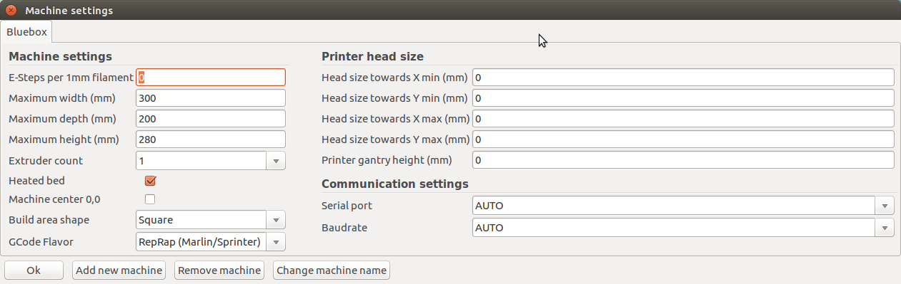

# Cura-Slicer Configuration

## Cura Configuration On Your PC or Mac
In order to configure Cura on your Computer for printing with a E3D BigBox printer do the following:
* Import the `cura_bigbox_bq_PLA.ini` file as a slicing profile
* Set the machine settings as in the picture below

## OctoPrint Slicer Profile
In order to configure the OctoPrint Cura engine, put the `mang_cura_9.profile` file into the `~/.octoprint/slicingProfiles/cura` folder on your print server
